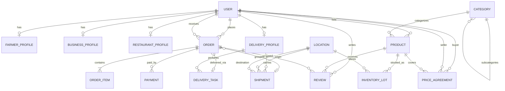

# FarmKart Entity-Relationship Model

## Overview

This document defines the complete entity-relationship model for the FarmKart platform, including core entities, their relationships, MongoDB schema design decisions, and data flow patterns for B2C and B2B operations.

---

## Core Entities

### 1. User
**Purpose**: Central entity representing all platform actors (farmers, customers, businesses, restaurants, delivery partners, admins).

**Key Fields**:
- `_id`: ObjectId (primary key)
- `email`: String (unique, indexed)
- `phone`: String (unique, indexed)
- `passwordHash`: String
- `roles`: String[] (`customer`, `farmer`, `business`, `restaurant`, `delivery`, `admin`)
- `status`: String (`active`, `suspended`, `pending_verification`)
- `kycStatus`: String (`not_started`, `pending`, `verified`, `rejected`)
- `addresses`: Object[] (embedded)
- `createdAt`, `updatedAt`: Date

**Relationships**:
- Has FarmerProfile (1:0..1)
- Has BusinessProfile (1:0..1)
- Has RestaurantProfile (1:0..1)
- Has DeliveryProfile (1:0..1)
- Lists Product (1:many) as owner
- Places Order (1:many) as buyer
- Receives Order (1:many) as seller
- Writes Review (1:many)

---

### 2. FarmerProfile
**Purpose**: Extended profile for users with the `farmer` role.

**Key Fields**:
- `_id`: ObjectId
- `userId`: ObjectId (unique, indexed)
- `farmName`: String
- `farmType`: String (`organic`, `conventional`, `mixed`)
- `farmSize`: Number (acres/hectares)
- `certifications`: String[]
- `bankAccount`: Object
- `payoutSchedule`: String
- `createdAt`, `updatedAt`: Date

---

### 3. BusinessProfile
**Purpose**: Extended profile for wholesale buyers, processors, manufacturers.

**Key Fields**:
- `_id`: ObjectId
- `userId`: ObjectId (unique, indexed)
- `companyName`: String
- `companyType`: String
- `gstNumber`: String (unique)
- `panNumber`: String
- `paymentTerms`: String
- `creditLimit`: Number
- `createdAt`, `updatedAt`: Date

---

### 4. RestaurantProfile
**Purpose**: Specialized business profile for restaurant partners.

**Key Fields**:
- `_id`: ObjectId
- `userId`: ObjectId (unique, indexed)
- `restaurantName`: String
- `cuisineType`: String[]
- `fssaiLicense`: String (unique)
- `deliveryWindowPreference`: String
- `createdAt`, `updatedAt`: Date

---

### 5. DeliveryProfile
**Purpose**: Profile for delivery partners.

**Key Fields**:
- `_id`: ObjectId
- `userId`: ObjectId (unique, indexed)
- `companyName`: String
- `scale`: String (`large`, `small`)
- `vehicleTypes`: String[]
- `coldChainCapable`: Boolean
- `serviceAreas`: Object[]
- `capacity`: Object
- `rating`: Number
- `createdAt`, `updatedAt`: Date

---

### 6. Product
**Purpose**: Agricultural products listed on the platform.

**Key Fields**:
- `_id`: ObjectId
- `ownerId`: ObjectId (indexed)
- `categoryId`: ObjectId (indexed)
- `name`: String
- `description`: String
- `unit`: String
- `basePrice`: Number
- `images`: String[]
- `isPerishable`: Boolean
- `shelfLife`: Number
- `tags`: String[]
- `status`: String
- `averageRating`: Number
- `createdAt`, `updatedAt`: Date

---

### 7. InventoryLot
**Purpose**: Tracks specific batches of products.

**Key Fields**:
- `_id`: ObjectId
- `productId`: ObjectId (indexed)
- `locationId`: ObjectId (indexed)
- `quantity`: Number
- `reservedQuantity`: Number
- `harvestDate`: Date
- `expiryDate`: Date (indexed)
- `batchNumber`: String
- `qualityGrade`: String
- `createdAt`, `updatedAt`: Date

---

### 8. Location
**Purpose**: Physical locations in the supply chain.

**Key Fields**:
- `_id`: ObjectId
- `type`: String (`farm`, `hub`, `dark_store`, `warehouse`)
- `name`: String
- `ownerId`: ObjectId (optional)
- `address`: Object
- `coordinates`: GeoJSON Point (indexed)
- `capacity`: Object
- `status`: String
- `createdAt`, `updatedAt`: Date

---

### 9. PriceAgreement
**Purpose**: B2B pricing contracts.

**Key Fields**:
- `_id`: ObjectId
- `sellerId`: ObjectId (indexed)
- `buyerId`: ObjectId (indexed)
- `productId`: ObjectId (indexed)
- `tiers`: Object[]
- `validFrom`: Date
- `validUntil`: Date
- `status`: String
- `createdAt`, `updatedAt`: Date

---

### 10. Order
**Purpose**: Purchase orders (B2C or B2B).

**Key Fields**:
- `_id`: ObjectId
- `orderNumber`: String (unique, indexed)
- `type`: String (`b2c`, `b2b`)
- `buyerId`: ObjectId (indexed)
- `sellerId`: ObjectId (indexed)
- `status`: String
- `orderItems`: Object[] (embedded)
- `subtotal`: Number
- `deliveryFee`: Number
- `total`: Number
- `scheduledWindowStart`: Date
- `scheduledWindowEnd`: Date
- `createdAt`, `updatedAt`: Date

---

### 11. Shipment
**Purpose**: Long-haul transportation.

**Key Fields**:
- `_id`: ObjectId
- `shipmentNumber`: String (unique)
- `carrierId`: ObjectId (indexed)
- `originLocationId`: ObjectId
- `destinationLocationId`: ObjectId
- `orderIds`: ObjectId[]
- `status`: String
- `vehicleType`: String
- `temperatureRange`: Object
- `departureTime`: Date
- `estimatedArrival`: Date
- `trackingUpdates`: Object[]
- `createdAt`, `updatedAt`: Date

---

### 12. DeliveryTask
**Purpose**: Last-mile delivery tasks.

**Key Fields**:
- `_id`: ObjectId
- `taskNumber`: String (unique)
- `carrierId`: ObjectId (indexed)
- `status`: String
- `stops`: Object[] (embedded)
- `routeOptimized`: Boolean
- `totalDistance`: Number
- `startTime`: Date
- `endTime`: Date
- `createdAt`, `updatedAt`: Date

---

### 13. Payment
**Purpose**: Payment transactions.

**Key Fields**:
- `_id`: ObjectId
- `orderId`: ObjectId (indexed)
- `amount`: Number
- `currency`: String
- `method`: String
- `status`: String
- `transactionId`: String
- `paidAt`: Date
- `createdAt`, `updatedAt`: Date

---

### 14. Review
**Purpose**: Product reviews and ratings.

**Key Fields**:
- `_id`: ObjectId
- `userId`: ObjectId (indexed)
- `productId`: ObjectId (indexed)
- `orderId`: ObjectId (indexed)
- `rating`: Number (1-5)
- `title`: String
- `comment`: String
- `verifiedPurchase`: Boolean
- `status`: String
- `createdAt`, `updatedAt`: Date

---

### 15. Category
**Purpose**: Product taxonomy.

**Key Fields**:
- `_id`: ObjectId
- `name`: String (unique)
- `slug`: String (unique, indexed)
- `parentId`: ObjectId (optional)
- `description`: String
- `isActive`: Boolean
- `createdAt`, `updatedAt`: Date

---

## Entity-Relationship Diagram (Mermaid)



---

## MongoDB Design Decisions

### Embedding vs Referencing Strategy

#### Embed When:
1. User Addresses (small, fixed-size)
2. Order Items (tightly coupled, accessed together)
3. Delivery Task Stops (fixed at creation)
4. Tracking Updates (predictable growth)
5. Price Agreement Tiers (small, fixed)

#### Reference When:
1. User Profiles (large, specialized)
2. Products (large catalog, independent queries)
3. Inventory Lots (location-based queries)
4. Orders (large volume, complex queries)
5. Shipments & Delivery Tasks (independent workflows)
6. Reviews (unbounded growth)
7. Categories (shared across products)

### Collection Structure

```
Collections:
├── users
├── farmer_profiles
├── business_profiles
├── restaurant_profiles
├── delivery_profiles
├── categories
├── products
├── inventory_lots
├── locations
├── price_agreements
├── orders
├── shipments
├── delivery_tasks
├── payments
└── reviews
```

---

## Data Flow Patterns

### B2C Order Flow

```
1. Customer browses products
2. Customer adds to cart (reserve inventory)
3. Customer places order
4. Seller confirms order
5. Hub picks and packs
6. Last-mile delivery
7. Delivery complete
8. Customer reviews product
```

### B2B Order Flow

```
1. Business checks catalog and pricing
2. Business places bulk order with schedule
3. Seller confirms and aggregates inventory
4. Long-haul shipment to city hub
5. Hub receives and sorts
6. Early-morning delivery to business
7. Business receives goods
8. Payment settlement per terms
```

### Inventory Management Flow

```
1. Farmer adds stock at farm
2. Hub receives shipment
3. Real-time availability display
4. Order allocation (FIFO)
5. Order fulfillment
6. Expiry alerts
7. Stock reports and analytics
```

### Pricing Management Flow

```
1. Farmer sets base price
2. Business requests bulk pricing
3. B2B order applies tiered pricing
4. Market intelligence displayed
5. Dynamic pricing (future feature)
```

---

## Next Steps for Implementation

1. Create Mongoose Schemas for all collections
2. Define Data Validation Rules
3. Implement Middleware (hooks, virtuals, methods)
4. Design REST API Endpoints
5. Set Up Database Migrations
6. Implement Business Logic
7. Add Real-time Features
8. Performance Testing

---

*Last Updated: October 25, 2025*
